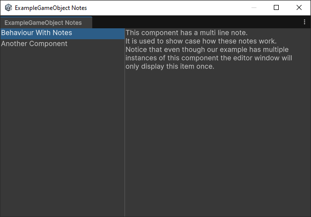
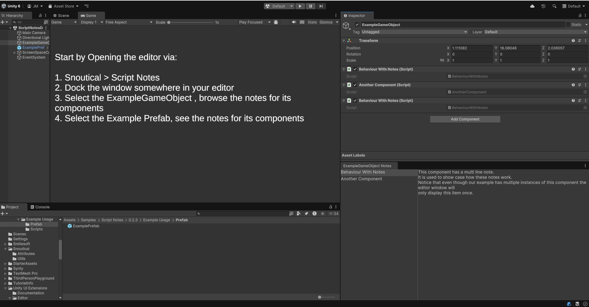

# com.snoutical.script-notes (Script Notes)

Script Notes lets you set a note on a script via an attribute
and provides an editor window to display those notes when an object contains
MonoBehaviours with notes on them.

Since getting the XML documentation for your scripts and displaying that in Unity is
fairly challenging, a `ScriptNote` can be used as an alternative.

